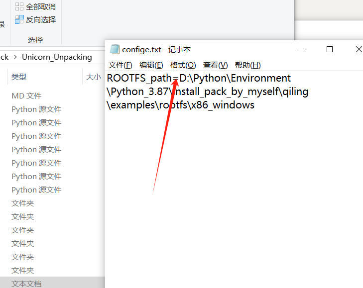
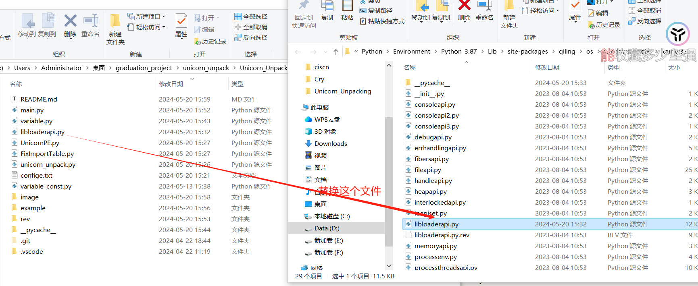

A poor graduation design 

### Dependency library

```
pip install qiling					# Version: 1.4.4
pip install unicorn					# Version: 2.0.0
pip install capstone
pip install lief					# Version: 0.14.1
pip install pefile 					# Version: 2022.5.30
pip install argparse
```

### usage

1、set ROOTFS_path



2、Make sure you configure the qiling before you use it

https://docs.qiling.io/en/latest/install/


3、patch qiling



4、enjoy it

### Some progress so far

1、The tool can only solve some compression shells at present, such as upx、aspack、nspack

2、The tool is currently only available on windows platforms and only exe file

3、Linux platforms, dll files, and sys files will be supported soon

4、coming soon ...

