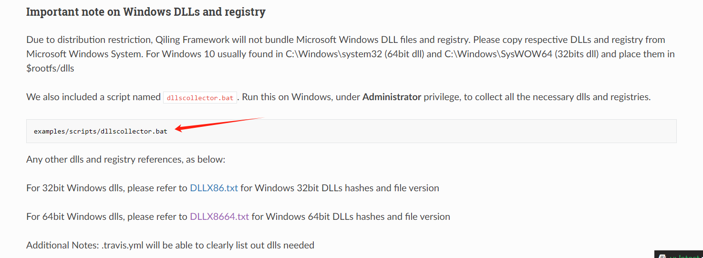

A poor graduation design 

### Dependency library

```
pip install qiling
pip install unicorn
pip install capstone
pip install lief
pip install pefile
pip install argparse
```

### usage

1、open main.py and set debug_level、unpack_path、dump_path、ROOTFS_path


2、Make sure you configure the qiling before you use it

https://docs.qiling.io/en/latest/install/



3、enjoy it

### Some progress so far

1、The tool can only solve some compression shells at present, such as upx、aspack、nspack

2、The tool is currently only available on windows platforms and only exe file

3、Linux platforms, dll files, and sys files will be supported soon

4、coming soon ...

