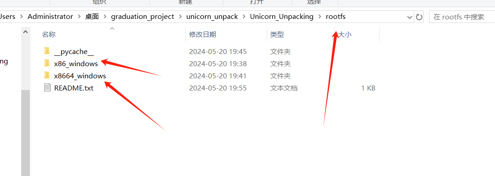
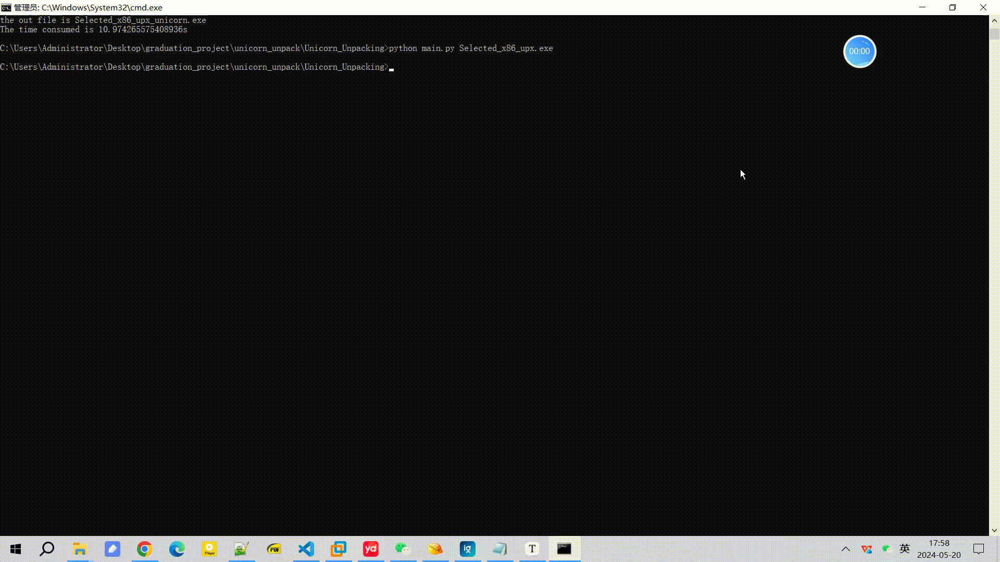

A poor graduation design 

### Dependency library

```
pip install qiling					# Version: 1.4.4
pip install unicorn					# Version: 2.0.0
pip install capstone
pip install lief					# Version: 0.14.1
pip install pefile 					# Version: 2022.5.30
pip install argparse
```

### Some considerations

<mark>1、The roofs directory of this project is very large, about 600MB,so I didn't upload it to github.</mark>

<mark> 2、If you have already downloaded the rootfs of qiling,you can copy your roofs directory to the root of your project.</mark>

<mark>3、If you don't have a roofs catalogue for qiling, you can download it from the qiling website, or you can download my roofs catalogue.</mark>

my roofs catalogues: https://pan.baidu.com/s/1m8luGYCNo2O4Hx0O6GjyCA?pwd=btcc 

official: https://docs.qiling.io/en/latest/install/


Please download the roofs directory of qiling and copy it here:




### How to use it

The most commonly used command：

```
python main.py xxx.exe -m 1     					# -m , unpacking mode ,you can selected 1 or 2
python main.py xxx.exe -m -1 -l 1 					# -l , debug_level ,1 or 2 
python main.py xxx.exe -m -1 -l 1 -o x.exe 			# -o , output path 
python main.py xxx.exe -m -1 -l 1 -t 1 -o x.exe 	# -t , address trace , so slow... 
```

demonstration:




### Some progress so far

1、The tool can only solve some compression shells at present, such as upx、aspack、nspack、fsg

2、The tool is currently only available on windows platforms and only exe file

3、Linux platforms, dll files, and sys files will be supported soon

4、coming soon ...

